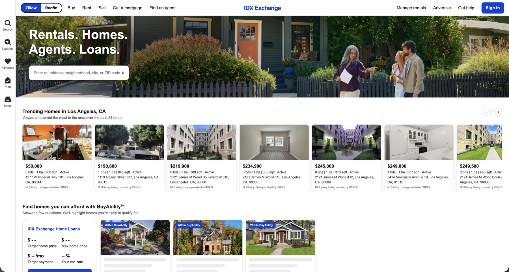
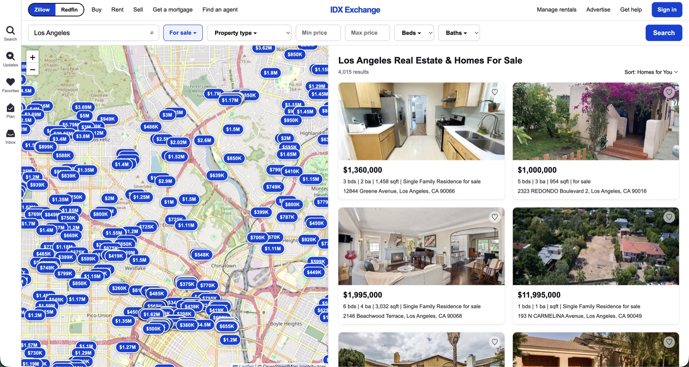
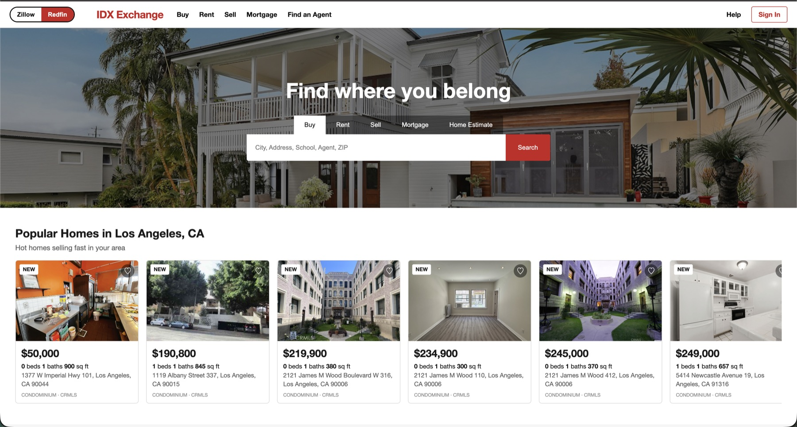
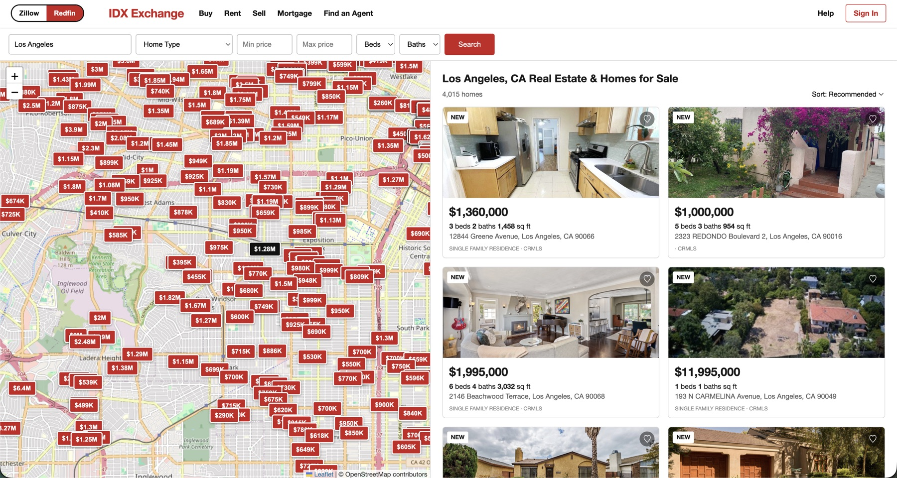

# IDX Exchange

A Zillow-style property search app backed by real MLS (IDX) data.
React (Vite) -> Express API -> MySQL 8. React never talks to MySQL directly.

Switch between the two site styles with the Zillow | Redfin toggle in the header.

### Zillow style




### Redfin style (`/redfin`)




## Features
- Home page with trending listings and open-house badges
- `/for-sale` search: city/ZIP/address, price, beds, baths, type, sort, pagination
- `/rent` search: same filters/layout as `/for-sale`, scoped to lease listings (see `RENTAL_PROPERTY_TYPES` below)
- Interactive map showing every matching listing as a price pin (Leaflet + OpenStreetMap, no API key)
- Property detail page: photos, remarks, upcoming open houses, map (shows `/mo` pricing for rentals)
- Mortgage payment calculator; Sell, Find an agent, etc. show "Coming soon"

## Prerequisites
Node.js (LTS), npm, Docker Desktop, and the two data files `rets_property.sql` and
`rets_openhouse.sql` (not included in this repo; obtain them from your IDX Exchange contact).

## 1. Start MySQL and import the data
```bash
docker run -d --name idx-mysql-local -p 3306:3306 \
  -e MYSQL_ROOT_PASSWORD=your_mysql_root_password -e MYSQL_DATABASE=rets mysql:8

docker exec -i idx-mysql-local mysql -uroot -pyour_mysql_root_password rets < rets_openhouse.sql
docker exec -i idx-mysql-local mysql -uroot -pyour_mysql_root_password rets < rets_property.sql
```
The property file is large; the import takes a few minutes.
Verify: `SELECT COUNT(*) FROM rets_property;` returns a non-zero number.
Next time, just `docker start idx-mysql-local`.

## 2. Run the API (port 5001)
```bash
cd backend
cp .env.example .env      # then set DB_PASSWORD
npm install
npm run dev
```
Check http://localhost:5001/api/health -> `{"status":"ok","database":"connected"}`.
(Port 5000 is avoided because macOS AirPlay uses it.)

Endpoints: `GET /api/health`, `GET /api/properties`, `GET /api/properties/map`,
`GET /api/properties/:id`, `GET /api/cities`.

### `GET /api/properties` (Week 3)
```
GET /api/properties?city=Irvine&minPrice=300000&beds=3&limit=20&offset=0
-> { "total": 87, "limit": 20, "offset": 0, "results": [...] }
```
| Param | Rules |
|-------|-------|
| `limit` | integer 1-100, default 20 |
| `offset` | integer >= 0, default 0 (`page` is accepted as a legacy alias) |
| `city` | case/space-insensitive match |
| `zipcode` | 5 digits |
| `minPrice`, `maxPrice` | non-negative numbers, `minPrice <= maxPrice` |
| `beds`, `baths` | minimums (`>=`) |
| `sort` | `newest` (default), `price_asc`, `price_desc` |

Invalid input returns `400 { "error": "Invalid query parameters", "details": ["limit must be between 1 and 100", ...] }`.
Indexes: `backend/sql/week3_indexes.sql`; EXPLAIN notes: `backend/docs/week3-explain.md`.
Tests: `cd backend && npm test` (no database needed).

`GET /api/properties` and `/api/properties/map` accept `category=rent` (or `sale`) to
scope results to lease vs. for-sale listings, based on `L_Type_`. Which type strings count
as rentals is configured via `RENTAL_PROPERTY_TYPES` in `backend/.env` (defaults to
`ResidentialLease,Apartment`) — check `SELECT DISTINCT L_Type_ FROM rets_property` against
your actual MLS feed and adjust if it uses different values, or the `/rent` page will just
come back empty.

## 3. Run the frontend
```bash
cd frontend
npm install
npm run dev
```
Open the URL Vite prints (http://localhost:3000, or 3001 if 3000 is taken).
Vite proxies `/api` to `http://localhost:5001` (see `frontend/vite.config.js`).

## Notes
- Never commit `.env` or the SQL files.
- Listing data is MLS data; use it only as your IDX Exchange access permits.
